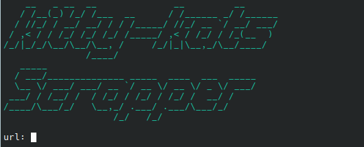

# Kitty-Kats Scraper
I got tired of the download speed limits on Keep2Share when trying to pirate MetArt albums from the Kitty-Kats website. This Python script scrapes HD images one by one from redirected hosting sites like "imagetwist.com", "imgspice.com", and "turbofile". Doesn't work for other than those yet. The images are saved in the ~/Pictures/.metart/ folder.

Update: You no longer need to paste URLs manually—the script automatically grabs them from your clipboard. The download time depends on your connection speed, but if the images are less than 5MB each, a whole album should take less than 20 minutes to download. I haven't implemented parallel downloading yet since I haven't learned about multi-threading. However, if you open multiple terminal sessions and download multiple albums simultaneously, they all finish in less than 30 minutes, so multi-threading isn't necessary for now.

Update: Scrappers for other porn pics websites are available.

#### Mika B (One of the Most Gorgeous Models from MetArt)

Mika B is the reason I started this project—I couldn't be satisfied with just the preview images from Pornpics. It’s unfortunate that she only did one project in her career. Maybe she was successful enough not to need a side hustle, or perhaps she got married and is living a happy life. I hope she's doing well.
